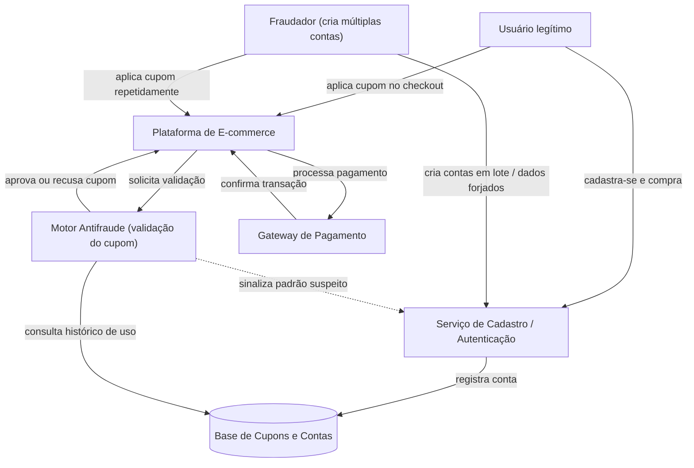

# Análise de Sistema Adversarial - Fraude no Resgate de Cupom de Desconto

**Disciplina:** [Engenharia de Software Adversarial]

**Grupo:** []

**Data Entrega:** [06/10/2026]

## Sumário

1. [Descrição do Sistema Adversarial](#1-descrição-do-sistema-adversarial)
2. [Modelo Estratégico Estático](#2-modelo-estratégico-estático)
3. [Modelo Estratégico Dinâmico](#3-modelo-estratégico-dinâmico)
4. [Ameaças e Riscos](#4-ameaças-e-riscos)
5. [Declaração de Uso de IA](#5-declaração-de-uso-de-ia-generativa)
6. [Referências](#6-referências)

---

## 1. Descrição do Sistema Adversarial

### 1.1 Sistema e interação analisada

O sistema analisado é uma **plataforma de e-commerce** e a interação específica avaliada é o **resgate de um cupom promocional de primeira compra** (`PRIMEIRACOMPRA10`, 10% de desconto), regra: **um cupom por pessoa física**, validado no momento do checkout.

Não se analisa o e-commerce como um todo — o recorte é estritamente o fluxo _cadastro → aplicação do cupom → checkout_, que é exatamente o que precisará virar código no Trabalho 2.

### 1.2 Atores

| Ator                              | Objetivo                                                                                   | Ações ou capacidades                                                                                                                                                                                   | Informações observáveis                                                                                       | Restrições ou custos                                                                                                             |
| --------------------------------- | ------------------------------------------------------------------------------------------ | ------------------------------------------------------------------------------------------------------------------------------------------------------------------------------------------------------ | ------------------------------------------------------------------------------------------------------------- | -------------------------------------------------------------------------------------------------------------------------------- |
| **Fraudador**                     | Resgatar o cupom o maior número de vezes possível, minimizando esforço e risco de bloqueio | Criar múltiplas contas (e-mails/telefones novos); usar CPFs gerados ou de terceiros; reutilizar cartões pré-pagos; mascarar IP/dispositivo (VPN, device farm); automatizar cadastros via script        | Mensagens do sistema (cupom aceito/recusado, conta bloqueada); tempo de resposta; se a compra foi aprovada    | Custo de criar identidades falsas (tempo, dados, cartões); risco de banimento; CAPTCHA; limite de tentativas                     |
| **Sistema Antifraude (defensor)** | Impedir uso indevido do cupom preservando conversão dos clientes legítimos                 | Validar CPF/e-mail únicos; fingerprint de dispositivo; blacklist de domínios de e-mail descartável; análise de IP/geolocalização; exigir verificação extra (SMS, documento); bloquear contas suspeitas | Padrões de cadastro (velocidade, IPs repetidos, device reincidente); histórico de uso do cupom por CPF/cartão | Custo de fricção sobre usuários legítimos (queda de conversão); custo operacional/computacional da verificação; falsos positivos |

### 1.3 Ativo a preservar

**Integridade financeira do programa promocional** e **justiça de distribuição do benefício** entre clientes legítimos — sem que a defesa gere fricção excessiva a ponto de prejudicar a experiência de quem não está fraudando.

### 1.4 Pressupostos do sistema

1. **CPF identifica uma pessoa única e não pode ser facilmente reciclado.**
   _Como pode falhar:_ existem geradores de CPF matematicamente válidos ("de fachada") e vazamentos de bases de dados que fornecem CPFs reais de terceiros, permitindo ao fraudador usar identidades que passam na validação de formato/dígito verificador.

2. **Verificação por e-mail/telefone garante que uma pessoa real está por trás do cadastro.**
   _Como pode falhar:_ serviços de e-mail descartável (temp-mail) e SIMs virtuais de baixo custo permitem gerar identidades de verificação válidas em segundos, em lote.

### 1.5 Por que isso é adversarial (e não um erro/acidente)

Um erro de sistema é não-intencional e não se adapta a contramedidas. Aqui, o fraudador **tem um objetivo definido** (extrair valor do cupom), **observa a resposta do sistema** a cada tentativa (bloqueio, mensagem de erro) e **ajusta deliberadamente sua estratégia** para contornar a barreira encontrada — o que caracteriza um agente racional reagindo a incentivos, e não uma falha aleatória. O próprio sistema também age de forma estratégica, reagindo aos padrões observados. Essa dupla adaptação, ao longo de rodadas, é a marca de um sistema adversarial.

> **Diagrama de contexto:** ver [`diagramas/contexto.mmd`](diagramas/contexto.mmd)
> _(exportar para `diagramas/contexto.png` — ver instruções no final deste documento)_

---

## 5. Declaração de Uso de IA Generativa

O uso de IA generativa como apoio à implementação está declarado conforme a seção 6 do enunciado. Todas as escolhas de projeto documentadas aqui foram tomadas pelo grupo com base nas aulas apresentadas, e qualquer integrante pode explicar e justificar cada decisão de projeto.

As principais contribuições do agente foram:

-
-
-
- Correção gramatical e de estilo do README.md

## 6. Referências

Ver [`fontes/referencias.md`](fontes/referencias.md).

### Nota sobre os diagramas

Os arquivos-fonte editáveis (`.mmd`) estão em `diagramas/`. Para gerar os `.png` exigidos na estrutura de entrega, foi usado:

- [Mermaid Live Editor](https://mermaid.live);

Os diagramas também estão embutidos como blocos `mermaid` diretamente neste README, renderizados automaticamente pelo GitHub.
