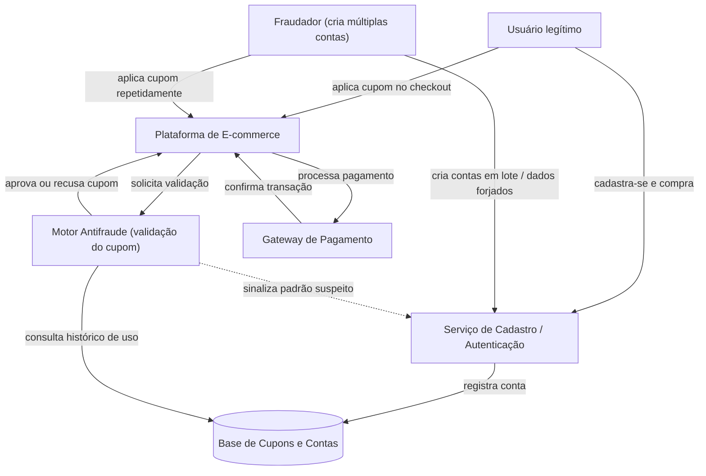

# Análise de Sistema Adversarial - Fraude no Resgate de Cupom de Desconto

**Disciplina:** [Engenharia de Software Adversarial]

**Grupo:** []

**Data Entrega:** [06/10/2026]

## Sumário

1. [Descrição do Sistema Adversarial](#1-descrição-do-sistema-adversarial)
2. [Modelo Estratégico Estático](#2-modelo-estratégico-estático)
3. [Modelo Estratégico Dinâmico](#3-modelo-estratégico-dinâmico)
4. [Ameaças e Riscos](#4-ameaças-e-riscos)
5. [Declaração de Uso de IA](#5-declaração-de-uso-de-ia-generativa)
6. [Referências](#6-referências)

---

## 1. Descrição do Sistema Adversarial

### 1.1 Sistema e interação analisada

O sistema analisado é uma **plataforma de e-commerce** e a interação específica avaliada é o **resgate de um cupom promocional de primeira compra** (`PRIMEIRACOMPRA10`, 10% de desconto), regra: **um cupom por pessoa física**, validado no momento do checkout.

Não se analisa o e-commerce como um todo — o recorte é estritamente o fluxo _cadastro → aplicação do cupom → checkout_, que é exatamente o que precisará virar código no Trabalho 2.

### 1.2 Atores

| Ator                              | Objetivo                                                                                   | Ações ou capacidades                                                                                                                                                                                   | Informações observáveis                                                                                       | Restrições ou custos                                                                                                             |
| --------------------------------- | ------------------------------------------------------------------------------------------ | ------------------------------------------------------------------------------------------------------------------------------------------------------------------------------------------------------ | ------------------------------------------------------------------------------------------------------------- | -------------------------------------------------------------------------------------------------------------------------------- |
| **Fraudador**                     | Resgatar o cupom o maior número de vezes possível, minimizando esforço e risco de bloqueio | Criar múltiplas contas (e-mails/telefones novos); usar CPFs gerados ou de terceiros; reutilizar cartões pré-pagos; mascarar IP/dispositivo (VPN, device farm); automatizar cadastros via script        | Mensagens do sistema (cupom aceito/recusado, conta bloqueada); tempo de resposta; se a compra foi aprovada    | Custo de criar identidades falsas (tempo, dados, cartões); risco de banimento; CAPTCHA; limite de tentativas                     |
| **Sistema Antifraude (defensor)** | Impedir uso indevido do cupom preservando conversão dos clientes legítimos                 | Validar CPF/e-mail únicos; fingerprint de dispositivo; blacklist de domínios de e-mail descartável; análise de IP/geolocalização; exigir verificação extra (SMS, documento); bloquear contas suspeitas | Padrões de cadastro (velocidade, IPs repetidos, device reincidente); histórico de uso do cupom por CPF/cartão | Custo de fricção sobre usuários legítimos (queda de conversão); custo operacional/computacional da verificação; falsos positivos |

### 1.3 Ativo a preservar

**Integridade financeira do programa promocional** e **justiça de distribuição do benefício** entre clientes legítimos — sem que a defesa gere fricção excessiva a ponto de prejudicar a experiência de quem não está fraudando.

### 1.4 Pressupostos do sistema

1. **CPF identifica uma pessoa única e não pode ser facilmente reciclado.**
   _Como pode falhar:_ existem geradores de CPF matematicamente válidos ("de fachada") e vazamentos de bases de dados que fornecem CPFs reais de terceiros, permitindo ao fraudador usar identidades que passam na validação de formato/dígito verificador.

2. **Verificação por e-mail/telefone garante que uma pessoa real está por trás do cadastro.**
   _Como pode falhar:_ serviços de e-mail descartável (temp-mail) e SIMs virtuais de baixo custo permitem gerar identidades de verificação válidas em segundos, em lote.

### 1.5 Por que isso é adversarial (e não um erro/acidente)

Um erro de sistema é não-intencional e não se adapta a contramedidas. Aqui, o fraudador **tem um objetivo definido** (extrair valor do cupom), **observa a resposta do sistema** a cada tentativa (bloqueio, mensagem de erro) e **ajusta deliberadamente sua estratégia** para contornar a barreira encontrada — o que caracteriza um agente racional reagindo a incentivos, e não uma falha aleatória. O próprio sistema também age de forma estratégica, reagindo aos padrões observados. Essa dupla adaptação, ao longo de rodadas, é a marca de um sistema adversarial.

> **Diagrama de contexto:** ver [`diagramas/contexto.mmd`](diagramas/contexto.mmd)
> _(exportar para `diagramas/contexto.png` — ver instruções no final deste documento)_

---

**## 2. Modelo Estratégico Estático**

### 2.1 Decisão central e jogadores

A decisão central analisada é a interação entre o **Fraudador** e o **Sistema Antifraude** durante uma tentativa de resgate do cupom `PRIMEIRACOMPRA10`.

O **Fraudador** precisa decidir se irá tentar reutilizar o cupom ou se irá desistir da tentativa. O **Sistema Antifraude**, por sua vez, precisa decidir se irá permitir ou bloquear a utilização do cupom.

Para representar essa situação como um jogo, são considerados dois jogadores e duas ações possíveis para cada um.

- **Jogador A — Fraudador**
  - **A1 – Tentar reutilizar:** tenta obter novamente o desconto de primeira compra.
  - **A2 – Desistir:** não tenta reutilizar o cupom.

- **Jogador B — Sistema Antifraude**
  - **B1 – Permitir:** aceita a utilização do cupom.
  - **B2 – Bloquear:** identifica a tentativa como suspeita e impede a utilização.

Os valores utilizados representam a ordem de preferência de cada jogador, sendo **3 o melhor resultado e 0 o pior**. A ordem dos valores em cada célula é **(payoff do Fraudador, payoff do Sistema Antifraude)**.

### 2.2 Matriz de payoffs

| Fraudador \ Sistema Antifraude | **B1 – Permitir** | **B2 – Bloquear** |
|---|---:|---:|
| **A1 – Tentar reutilizar** | **(3, 0)** | **(0, 2)** |
| **A2 – Desistir** | **(1, 1)** | **(1, 1)** |

### 2.3 Explicação das ações

A ação **A1 – Tentar reutilizar** representa o comportamento adversarial no qual o fraudador tenta utilizar novamente um benefício que deveria estar disponível apenas uma vez por pessoa física. Isso pode ocorrer por meio da criação de novas contas ou utilização de diferentes identidades e dados de cadastro.

A ação **A2 – Desistir** representa a situação em que o fraudador não continua a tentativa de reutilização do cupom.

Para o Sistema Antifraude, **B1 – Permitir** representa a aceitação da utilização do cupom, enquanto **B2 – Bloquear** representa a identificação da tentativa como suspeita e o impedimento do resgate.

### 2.4 Justificativa dos payoffs

Os valores da matriz representam os benefícios e custos relativos de cada resultado para os dois jogadores.

- **(3, 0):** o fraudador tenta reutilizar o cupom e o sistema permite a operação. Esse é o melhor resultado para o fraudador, pois ele consegue obter novamente o desconto. Para o sistema, o resultado é o pior, pois a regra de um cupom por pessoa é violada.

- **(0, 2):** o fraudador tenta reutilizar o cupom, mas o sistema bloqueia a operação. O fraudador não consegue obter o benefício e recebe o menor payoff. Para o sistema, esse é um resultado positivo, pois a tentativa de fraude é impedida.

- **(1, 1):** o fraudador desiste da tentativa. Nesse caso, não há obtenção de um novo desconto, mas também não há uma perda adicional causada por uma tentativa bloqueada. Por isso, ambos recebem um payoff intermediário de 1. Como o fraudador já desistiu, a escolha do sistema entre permitir ou bloquear não altera esse resultado.

### 2.5 Melhores respostas

As melhores respostas dependem da decisão tomada pelo outro jogador.

Para o **Fraudador**:

- Se o Sistema Antifraude escolher **B1 – Permitir**, o Fraudador prefere **A1 – Tentar reutilizar**, pois recebe **3**, enquanto desistir gera **1**.
- Se o Sistema Antifraude escolher **B2 – Bloquear**, o Fraudador prefere **A2 – Desistir**, pois recebe **1**, enquanto tentar reutilizar gera **0**.

Portanto, a melhor decisão do Fraudador depende da escolha do Sistema Antifraude.

Para o **Sistema Antifraude**:

- Se o Fraudador escolher **A1 – Tentar reutilizar**, o Sistema prefere **B2 – Bloquear**, pois recebe **2**, enquanto permitir gera **0**.
- Se o Fraudador escolher **A2 – Desistir**, tanto **B1 – Permitir** quanto **B2 – Bloquear** geram payoff **1**. Portanto, nesse caso, o sistema é indiferente entre as duas ações.

Assim, também para o Sistema Antifraude a melhor resposta depende da ação escolhida pelo Fraudador.

### 2.6 Estratégia dominante

Não existe uma estratégia dominante para o **Fraudador**.

Quando o Sistema permite a utilização, a melhor escolha do Fraudador é tentar reutilizar o cupom. Porém, quando o Sistema bloqueia, a melhor escolha é desistir.

Para o **Sistema Antifraude**, bloquear é a melhor resposta quando existe uma tentativa de reutilização. Quando o Fraudador desiste, as duas ações possuem o mesmo payoff.

Dessa forma, o modelo não apresenta uma estratégia dominante que seja sempre a melhor independentemente da escolha do outro jogador.

### 2.7 Equilíbrio de Nash

Existem dois resultados nos quais nenhum dos jogadores consegue melhorar seu payoff mudando sua ação sozinho:

- **(A1, B1) = (3, 0)**
- **(A2, B2) = (1, 1)**

No resultado **(A1, B1)**, o Fraudador tenta reutilizar e o Sistema permite. O Fraudador não possui incentivo para mudar sozinho, pois passaria de 3 para 1. Entretanto, é importante observar que o Sistema **possui incentivo para mudar sozinho**, passando de 0 para 2 ao bloquear. Portanto, **(A1, B1) não é um equilíbrio de Nash**.

O resultado **(A2, B2) = (1, 1)** é um equilíbrio de Nash. Se o Fraudador mudar sozinho para tentar reutilizar, seu payoff cairá de 1 para 0. Se o Sistema mudar sozinho de bloquear para permitir, seu payoff permanecerá 1. Portanto, nenhum dos jogadores melhora seu resultado com uma mudança unilateral.

Assim, o equilíbrio de Nash do modelo é:

**(Desistir, Bloquear) = (1, 1)**

### 2.8 Resultado para o sistema e para os usuários legítimos

O resultado **(Desistir, Bloquear)** é positivo para a proteção do sistema porque a tentativa de reutilização do cupom não ocorre e o Sistema Antifraude mantém a barreira contra o uso indevido do benefício.

Para os usuários legítimos, esse resultado contribui para preservar a regra de **um cupom por pessoa física**, evitando que o benefício destinado a novos clientes seja consumido repetidamente por um mesmo fraudador.

O modelo também demonstra que a decisão de cada participante está relacionada à decisão do outro. O Fraudador considera se sua tentativa será permitida ou bloqueada, enquanto o Sistema Antifraude precisa reagir ao comportamento do Fraudador.

Dessa forma, a situação pode ser analisada como um jogo estratégico em que as escolhas dos participantes são interdependentes, e não como uma decisão isolada de apenas um dos lados.

---

**## 3. Modelo Estratégico Dinâmico**

> *Seção reservada para a modelagem da interação em múltiplas rodadas, considerando que os jogadores observam resultados anteriores e podem adaptar suas estratégias.*

---

**## 4. Ameaças e Riscos**

## 5. Declaração de Uso de IA Generativa

O uso de IA generativa como apoio à implementação está declarado conforme a seção 6 do enunciado. Todas as escolhas de projeto documentadas aqui foram tomadas pelo grupo com base nas aulas apresentadas, e qualquer integrante pode explicar e justificar cada decisão de projeto.

As principais contribuições do agente foram:

-
-
-
- Correção gramatical e de estilo do README.md

## 6. Referências

Ver [`fontes/referencias.md`](fontes/referencias.md).

### Nota sobre os diagramas

Os arquivos-fonte editáveis (`.mmd`) estão em `diagramas/`. Para gerar os `.png` exigidos na estrutura de entrega, foi usado:

- [Mermaid Live Editor](https://mermaid.live);

Os diagramas também estão embutidos como blocos `mermaid` diretamente neste README, renderizados automaticamente pelo GitHub.
