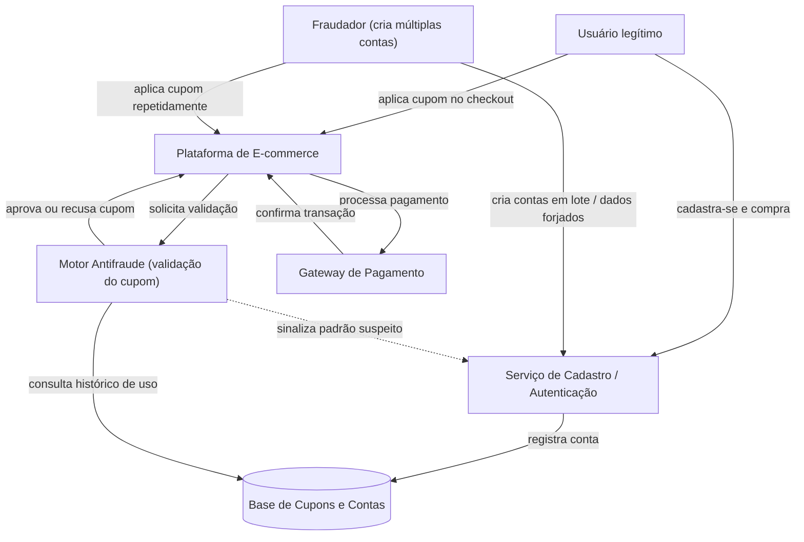
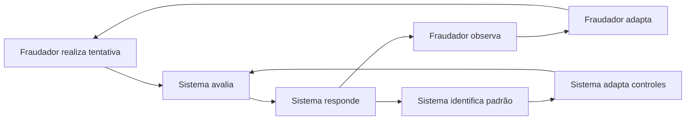
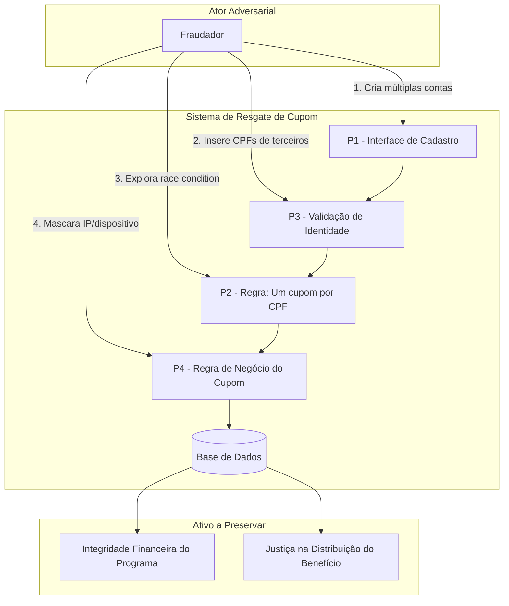

# Análise de Sistema Adversarial - Fraude no Resgate de Cupom de Desconto

**Disciplina:** [Engenharia de Software Adversarial]

**Grupo:** []

**Data Entrega:** [06/10/2026]

## Sumário

1. [Descrição do Sistema Adversarial](#1-descrição-do-sistema-adversarial)
2. [Modelo Estratégico Estático](#2-modelo-estratégico-estático)
3. [Modelo Estratégico Dinâmico](#3-modelo-estratégico-dinâmico)
4. [Ameaças e Riscos](#4-ameaças-e-riscos)
5. [Declaração de Uso de IA](#5-declaração-de-uso-de-ia-generativa)
6. [Referências](#6-referências)

---

## 1. Descrição do Sistema Adversarial

### 1.1 Sistema e interação analisada

O sistema analisado é uma **plataforma de e-commerce** e a interação específica avaliada é o **resgate de um cupom promocional de primeira compra** (`PRIMEIRACOMPRA10`, 10% de desconto), regra: **um cupom por pessoa física**, validado no momento do checkout.

A regra de negócio analisada estabelece que o benefício pode ser utilizado uma única vez por pessoa física. A elegibilidade é verificada durante o processo de checkout.

O trabalho não analisa o e-commerce em sua totalidade. O escopo está restrito ao fluxo:

cadastro → aplicação do cupom → validação antifraude → checkout

Durante esse fluxo, o sistema recebe informações cadastrais e transacionais, como CPF, e-mail, telefone, dispositivo, endereço de rede, meio de pagamento e histórico de utilização do benefício. A partir dessas informações, o sistema pode tomar uma das seguintes decisões:

autorizar a aplicação do cupom;

rejeitar a aplicação do cupom;

solicitar uma verificação adicional.

Esse recorte foi escolhido por representar uma interação suficientemente pequena para análise no Trabalho 1 e posterior implementação no Trabalho 2.

### 1.2 Atores

| **Ator** | **Objetivo** | **Ações ou capacidades** | **Informações observáveis** | **Restrições ou custos** |
|---|---|---|---|---|
| **Fraudador** | Obter repetidamente o benefício promocional, reduzindo o custo das compras e evitando mecanismos de detecção. | Criar múltiplas identidades digitais; alterar dados cadastrais; variar sinais de dispositivo ou rede; realizar sucessivas tentativas de resgate. | Aceitação ou rejeição do cupom; solicitação de verificação adicional; bloqueio da conta; aprovação ou rejeição da compra. | Tempo e esforço para criação de novas identidades; necessidade de novos meios de verificação; possibilidade de bloqueio; limitação de tentativas. |
| **Sistema Antifraude (defensor)** | Impedir usos indevidos do benefício sem gerar fricção excessiva para usuários legítimos. | Validar unicidade de dados; correlacionar contas; analisar sinais cadastrais, transacionais, de dispositivo e rede; solicitar verificações adicionais; bloquear tentativas suspeitas. | Frequência e velocidade dos cadastros; repetição de dispositivos, meios de pagamento ou outros sinais; histórico de utilização do cupom; resultados das verificações anteriores. | Custo computacional e operacional; possibilidade de falsos positivos; aumento de fricção durante o checkout; eventual redução da taxa de conversão. |
| **Cliente legítimo** | Utilizar corretamente o benefício em sua primeira compra e concluir o checkout com pouca fricção. | Criar uma conta; informar dados cadastrais; aplicar o cupom; realizar verificações solicitadas; concluir a compra. | Resultado da validação do cupom; mensagens de erro; solicitações adicionais de confirmação. | Tempo necessário para concluir verificações; possibilidade de bloqueio incorreto; abandono da compra caso o processo seja excessivamente complexo. |


### 1.3 Ativos e propriedades a preservar

O principal ativo do sistema é a **integridade financeira do programa promocional**, garantindo que o desconto seja concedido somente aos usuários que atendam aos critérios estabelecidos.

Além disso, o sistema deve preservar:

- **Justiça na distribuição do benefício**, evitando que um mesmo agente obtenha vantagens repetidas;
- **Confiabilidade da regra de primeira compra**, garantindo que o benefício seja utilizado conforme as condições da promoção;
- **Experiência dos clientes legítimos**, reduzindo falsos positivos e verificações desnecessárias;
- **Sustentabilidade econômica da promoção**, evitando perdas financeiras provocadas pelo uso indevido do cupom.

Existe, portanto, um compromisso entre **segurança e usabilidade**: controles mais rigorosos podem reduzir a ocorrência de fraude, mas também podem aumentar a fricção enfrentada pelos compradores legítimos.

### 1.4 Pressupostos do sistema

O funcionamento do mecanismo antifraude depende de alguns pressupostos.

### 1.4.1 Identificadores cadastrais representam adequadamente uma pessoa

O sistema assume que informações como **CPF, telefone e e-mail** permitem diferenciar compradores distintos.

**Como esse pressuposto pode falhar:** diferentes identidades digitais podem ser utilizadas pelo mesmo agente ou dados válidos pertencentes a terceiros podem aparecer em novos cadastros, dificultando a identificação de que diferentes contas estão relacionadas.

### 1.4.2 Verificações de contato aumentam a confiança na identidade cadastrada

O sistema assume que a confirmação de **e-mail ou telefone** representa uma barreira suficiente para dificultar a criação repetida de contas.

**Como esse pressuposto pode falhar:** um mesmo agente pode conseguir acesso a múltiplos canais de contato ou criar novas identidades digitais com baixo custo, reduzindo a eficácia desse mecanismo de validação.

### 1.4.3 Sinais técnicos e transacionais permitem correlacionar contas relacionadas

O sistema assume que informações como **dispositivo, endereço de rede, meio de pagamento e padrões de comportamento** podem indicar que diferentes contas pertencem ao mesmo agente.

**Como esse pressuposto pode falhar:** esses sinais podem variar entre diferentes tentativas. Além disso, clientes legítimos podem compartilhar determinadas características, como a mesma rede, endereço ou dispositivo, aumentando o risco de falsos positivos.

### 1.5 Por que isso é adversarial (e não um erro/acidente)

Um erro de sistema é não-intencional e não se adapta a contramedidas. Aqui, o fraudador **tem um objetivo definido** (extrair valor do cupom), **observa a resposta do sistema** a cada tentativa (bloqueio, mensagem de erro) e **ajusta deliberadamente sua estratégia** para contornar a barreira encontrada — o que caracteriza um agente racional reagindo a incentivos, e não uma falha aleatória. O próprio sistema também age de forma estratégica, reagindo aos padrões observados. Essa dupla adaptação, ao longo de rodadas, é a marca de um sistema adversarial.

> **Diagrama de contexto:** ver [`diagramas/contexto.mmd`](diagramas/contexto.mmd)
> _(exportar para `diagramas/contexto.png` — ver instruções no final deste documento)_



O cenário analisado não representa apenas um erro de software ou uma utilização acidental da promoção.

Existe um participante com objetivo próprio — o **fraudador** — que procura obter repetidamente um benefício que deveria ser concedido apenas uma vez. Para atingir esse objetivo, ele realiza ações, observa as respostas produzidas pelo sistema e pode modificar seu comportamento nas tentativas seguintes.

O **sistema antifraude** também possui um objetivo próprio: preservar a regra da promoção e reduzir perdas financeiras sem prejudicar excessivamente os clientes legítimos. Para isso, observa padrões de comportamento e pode modificar suas decisões ou exigir verificações adicionais.

Forma-se, portanto, um ciclo de interação adversarial:

```text
Ação do participante
        ↓
Resposta do sistema
        ↓
Observação do resultado
        ↓
Adaptação da estratégia
        ↓
Nova ação
```

A presença de **objetivos parcialmente conflitantes**, informações observáveis e capacidade de adaptação caracteriza o problema como um **sistema adversarial**, e não simplesmente como uma falha ou erro acidental.

---

## 1.6 Delimitação arquitetural

Para fins do Trabalho 2, o cenário pode ser inicialmente representado pelos seguintes componentes:

```text
Cliente/Fraudador
       │
       ▼
    Cadastro
       │
       ▼
Serviço de Cupons
       │
       ▼
Módulo Antifraude
       │
       ▼
    Checkout
```

O **Módulo Antifraude** recebe sinais associados à tentativa de utilização do benefício e produz uma decisão que influencia a continuidade do checkout.

De maneira simplificada:

```text
                         ┌────────────────────┐
                         │ Cliente legítimo   │
                         └─────────┬──────────┘
                                   │
                                   ▼
┌──────────────┐          ┌───────────────────┐
│  Fraudador   │─────────►│ Plataforma        │
└──────────────┘          │ de E-commerce     │
                          └─────────┬─────────┘
                                    │
                                    ▼
                          ┌───────────────────┐
                          │ Serviço de Cupons │
                          └─────────┬─────────┘
                                    │
                                    ▼
                          ┌───────────────────┐
                          │ Sistema Antifraude│
                          └─────────┬─────────┘
                                    │
                                    ▼
                          ┌───────────────────┐
                          │     Checkout      │
                          └───────────────────┘
```

---

## 1.7 Diagrama de contexto

O diagrama de contexto apresenta os principais participantes, componentes e interações existentes no cenário analisado.

O diagrama deve representar:

- **Cliente legítimo**;
- **Fraudador**;
- **Plataforma de e-commerce**;
- **Serviço de cupons**;
- **Sistema antifraude**;
- **Checkout**;
- Fluxo das solicitações e decisões tomadas pelo sistema.


---

## 2. Modelo Estratégico Estático

### 2.1 Decisão central e jogadores

A decisão central analisada é a interação entre o **Fraudador** e o **Sistema Antifraude** durante uma tentativa de resgate do cupom `PRIMEIRACOMPRA10`.

O **Fraudador** busca reutilizar um benefício destinado à primeira compra, enquanto o **Sistema Antifraude** busca identificar e impedir utilizações indevidas sem comprometer desnecessariamente a experiência dos usuários legítimos.

Para representar essa situação como um jogo, são considerados dois jogadores e duas estratégias possíveis para cada um.

- **Jogador A — Fraudador**
  - **A1 – Tentativa simples:** tenta reutilizar o benefício alterando poucos sinais identificadores.
  - **A2 – Tentativa adaptativa:** tenta reutilizar o benefício modificando múltiplos sinais para dificultar a correlação entre contas.

- **Jogador B — Sistema Antifraude**
  - **B1 – Validação básica:** utiliza um conjunto limitado de sinais para verificar a elegibilidade do usuário.
  - **B2 – Validação reforçada:** correlaciona múltiplos sinais e aplica controles adicionais para identificar tentativas de reutilização.

Os valores utilizados representam a ordem de preferência de cada jogador, sendo **3 o melhor resultado e 0 o pior**. A ordem dos valores em cada célula é **(payoff do Fraudador, payoff do Sistema Antifraude)**.

### 2.2 Matriz de payoffs

| Fraudador \ Sistema Antifraude | **B1 – Validação básica** | **B2 – Validação reforçada** |
|---|---:|---:|
| **A1 – Tentativa simples** | **(3, 0)** | **(0, 2)** |
| **A2 – Tentativa adaptativa** | **(3, 0)** | **(0, 2)** |

### 2.3 Explicação das estratégias

A estratégia **A1 – Tentativa simples** representa uma tentativa de reutilização do cupom na qual o Fraudador altera poucos sinais identificadores, facilitando sua correlação com utilizações anteriores.

A estratégia **A2 – Tentativa adaptativa** representa uma tentativa mais elaborada, na qual o Fraudador modifica múltiplos sinais para dificultar a identificação da reutilização do benefício.

Para o Sistema Antifraude, **B1 – Validação básica** representa uma análise baseada em um conjunto limitado de sinais de elegibilidade.

A estratégia **B2 – Validação reforçada** representa uma análise que correlaciona múltiplos sinais e aplica controles adicionais para aumentar a capacidade de identificação de tentativas de reutilização.

Dessa forma, o modelo representa a interação entre diferentes níveis de sofisticação da tentativa adversarial e diferentes níveis de capacidade de validação do sistema.

### 2.4 Justificativa dos payoffs

Os valores da matriz representam os benefícios e custos relativos de cada resultado para os dois jogadores.

- **(3, 0):** o Fraudador consegue reutilizar o benefício diante de uma validação básica. Esse é o melhor resultado para o Fraudador, pois a tentativa é bem-sucedida. Para o Sistema Antifraude, representa o pior resultado, pois a reutilização indevida não foi identificada.

- **(0, 2):** o Sistema Antifraude utiliza uma validação reforçada e impede a reutilização do benefício. O Fraudador não consegue obter o desconto e recebe o menor payoff. Para o Sistema, o resultado é positivo porque a tentativa de reutilização foi impedida.

A mesma estrutura de payoffs é aplicada às tentativas simples e adaptativas porque, no modelo estático, o resultado considerado é a obtenção ou não do benefício. A diferença de sofisticação entre A1 e A2 será explorada principalmente no modelo estratégico dinâmico, no qual o Fraudador pode adaptar seu comportamento em resposta às medidas adotadas pelo Sistema Antifraude.

### 2.5 Melhores respostas

As melhores respostas dependem da estratégia escolhida pelo outro jogador.

Para o **Fraudador**:

- Se o Sistema Antifraude escolher **B1 – Validação básica**, tanto **A1 – Tentativa simples** quanto **A2 – Tentativa adaptativa** geram payoff **3** para o Fraudador. Portanto, o Fraudador é indiferente entre as duas estratégias.
- Se o Sistema Antifraude escolher **B2 – Validação reforçada**, tanto **A1 – Tentativa simples** quanto **A2 – Tentativa adaptativa** geram payoff **0** para o Fraudador. Portanto, o Fraudador continua indiferente entre as duas estratégias.

Para o **Sistema Antifraude**:

- Se o Fraudador escolher **A1 – Tentativa simples**, o Sistema prefere **B2 – Validação reforçada**, pois recebe **2**, enquanto B1 gera **0**.
- Se o Fraudador escolher **A2 – Tentativa adaptativa**, o Sistema também prefere **B2 – Validação reforçada**, pois recebe **2**, enquanto B1 gera **0**.

Assim, **B2 – Validação reforçada é uma estratégia estritamente dominante para o Sistema Antifraude**. Para o Fraudador, não existe uma estratégia dominante estrita, pois A1 e A2 produzem o mesmo payoff em cada possível escolha do Sistema.

### 2.6 Estratégias dominantes

Uma estratégia é dominante quando proporciona ao jogador um resultado pelo menos tão bom quanto as demais estratégias, independentemente da escolha do adversário.

No modelo analisado, o **Sistema Antifraude possui uma estratégia dominante**:

- **B2 – Validação reforçada** gera payoff 2 para o Sistema tanto contra A1 quanto contra A2.
- **B1 – Validação básica** gera payoff 0 contra A1 e também contra A2.

Portanto, B2 proporciona um resultado estritamente melhor ao Sistema em qualquer situação.

Para o **Fraudador**, A1 e A2 produzem os mesmos payoffs em ambas as escolhas do Sistema. Assim, não existe uma estratégia dominante estrita entre as duas no modelo estático.

Essa característica também mostra uma limitação intencional do modelo estático: a diferença de sofisticação entre uma tentativa simples e uma tentativa adaptativa não altera o payoff diretamente. Essa diferença será explorada com maior importância no modelo estratégico dinâmico.

### 2.7 Equilíbrio de Nash

Um equilíbrio de Nash ocorre quando nenhum dos jogadores consegue melhorar seu payoff alterando sua estratégia individualmente, mantendo a estratégia do outro jogador fixa.

Na matriz proposta, existem dois equilíbrios de Nash em estratégias puras:

- **(A1, B2) = (0,2)**
- **(A2, B2) = (0,2)**

No equilíbrio **(A1, B2)**, o Fraudador recebe payoff 0 e não melhora ao mudar para A2, pois continuaria recebendo 0. O Sistema recebe payoff 2 e reduziria seu resultado para 0 caso mudasse de B2 para B1.

No equilíbrio **(A2, B2)**, ocorre o mesmo: o Fraudador continua com payoff 0 ao mudar para A1, enquanto o Sistema reduziria seu payoff de 2 para 0 caso escolhesse B1.

Assim, nos dois equilíbrios, o Sistema utiliza **B2 – Validação reforçada**, enquanto o Fraudador pode escolher entre A1 e A2 sem alterar seu payoff no modelo estático.

Essa característica reforça a diferença entre os modelos estático e dinâmico: no modelo estático, A1 e A2 são equivalentes em termos de payoff; no modelo dinâmico, a capacidade de adaptação do Fraudador poderá produzir diferenças ao longo das rodadas.

### 2.8 Conclusão do modelo estratégico estático

O modelo estratégico estático mostra que, considerando os payoffs definidos, a **Validação reforçada (B2)** é a estratégia dominante do Sistema Antifraude. Independentemente de o Fraudador realizar uma tentativa simples (A1) ou adaptativa (A2), a validação reforçada proporciona ao Sistema um payoff maior.

Para o Fraudador, A1 e A2 são equivalentes em termos de payoff neste modelo, pois ambas produzem o mesmo resultado diante de cada estratégia do Sistema. Isso significa que o modelo estático não diferencia a efetividade das duas formas de tentativa adversarial.

Essa limitação é intencional e motiva a utilização do **modelo estratégico dinâmico**, no qual as interações ocorrem em múltiplas rodadas e os jogadores podem observar resultados anteriores e adaptar suas estratégias.

Assim, o modelo estático estabelece uma situação inicial para a análise, enquanto o modelo dinâmico permite representar a evolução da disputa entre as tentativas do Fraudador e os mecanismos de defesa do Sistema Antifraude.

---

## 3. Modelo Estratégico Dinâmico

O modelo estático representa uma decisão em um único momento. No entanto, no sistema analisado, Fraudador e Sistema Antifraude podem observar resultados anteriores e adaptar suas estratégias ao longo de novas tentativas.

Esse comportamento é compatível com jogos entre atacante e defensor em múltiplos períodos, nos quais decisões anteriores podem influenciar ações posteriores (HAUSKEN; WELBURN; ZHUANG, 2024).

No sistema proposto, o objetivo do Fraudador permanece o mesmo: reutilizar o cupom `PRIMEIRACOMPRA10`. O que muda é a estratégia utilizada para tentar contornar os controles.

A interação segue o ciclo:

**ação → resposta → observação → adaptação**

### 3.1 Rodadas adversariais

| Rodada | Ação do Fraudador | Resposta do Sistema | O que se torna observável? | Adaptação seguinte |
|---|---|---|---|---|
| **1** | Cria uma nova conta e tenta reutilizar o cupom | O sistema consulta o histórico e recusa o benefício | Apenas criar outra conta pode não ser suficiente | O Fraudador altera outros dados da tentativa |
| **2** | Utiliza novos dados, IP ou dispositivo | O sistema cruza múltiplos sinais | A validação utiliza mais de um identificador | O Fraudador passa a alterar vários elementos |
| **3** | Combina diferentes identidades e sinais | O sistema identifica padrões e aplica controles adicionais | O sistema também utiliza o histórico das tentativas | O Fraudador procura outra forma de contornar a defesa |

A criação de múltiplas contas para obter repetidamente um benefício é um exemplo de abuso de lógica de negócio. A OWASP recomenda que sistemas de promoções não dependam de um único identificador e considerem diferentes sinais, como dispositivo, endereço IP, telefone e meio de pagamento (OWASP FOUNDATION, 2026).

### 3.2 Quem observa quem?

A observação ocorre nos dois sentidos. O Fraudador observa respostas como aceitação, rejeição ou bloqueio. O Sistema Antifraude observa cadastros, tentativas de resgate, histórico de utilização e padrões de comportamento.

### 3.3 O que cada lado consegue modificar?

O Fraudador pode alterar conta, e-mail, telefone, CPF, dispositivo, endereço IP ou meio de pagamento.

O Sistema Antifraude pode alterar regras de validação, limites de tentativas e quantidade de sinais analisados.

### 3.4 O que dispara uma adaptação?

Para o Fraudador, a adaptação ocorre quando uma tentativa é rejeitada ou quando a resposta indica que determinada estratégia deixou de funcionar.

Para o Sistema Antifraude, a adaptação ocorre quando surgem novos padrões de abuso ou quando os controles existentes deixam de ser suficientes.

### 3.5 Custo da adaptação

Para o Fraudador, cada adaptação exige mais esforço, dados ou recursos.

Para o Sistema Antifraude, controles adicionais aumentam a complexidade e podem gerar falsos positivos ou dificultar o uso do cupom por clientes legítimos.

### 3.6 Possível corrida armamentista

A corrida armamentista surge quando cada novo controle leva o Fraudador a buscar uma nova forma de contorná-lo.

Por exemplo:

**controle por conta → novas contas → controle por CPF/telefone → alteração de dados → uso de sinais adicionais.**

Nesse processo, cada lado reage às decisões do outro. Em jogos atacante-defensor com múltiplos períodos, esse tipo de adaptação sucessiva é parte central da interação estratégica (HAUSKEN; WELBURN; ZHUANG, 2024).

### 3.7 Diagrama do ciclo adaptativo


---

## 4. Ameaças e Riscos

### 4.1 Pontos de Exploração

A interação analisada — _cadastro → aplicação do cupom → checkout_ — possui quatro pontos principais de exploração, onde regras, interfaces ou pressupostos podem ser contornados:

|  | Ponto de Exploração | Descrição | Pressuposto ou Fraqueza Associada |
|---|---|---|---|
| P1 | Interface de Cadastro | Canal por onde o fraudador cria contas e insere dados (e-mail, CPF, telefone) | Sistema assume que e-mail/telefone válidos implicam pessoa real e distinta |
| P2 | Regra "Um cupom por CPF" | Validação de unicidade do benefício por pessoa física | Verificação e marcação de uso não são atômicas — janela de race condition |
| P3 | Validação de Identidade (CPF) | Camada que verifica formato e dígito verificador do CPF | Assume que CPF válido = titular autêntico, ignorando CPFs de fachada ou vazados |
| P4 | Regra de Negócio do Cupom | Lógica de aplicação do desconto no checkout | Ausência de correlação entre múltiplos sinais (dispositivo, IP, pagamento) |

### 4.2 Diagrama de Superfície de Ataque

O diagrama abaixo representa visualmente os pontos de exploração (P1-P4), os componentes do sistema envolvidos e o ativo a preservar.



### 4.3 Cenários de Ameaça

##### A1 - Race Condition no Resgate do Cupom

Um fraudador pode disparar dezenas de requisições simultâneas de resgate do mesmo cupom por meio da regra "um cupom por CPF" (P2), aproveitando a separação entre "CPF ainda não usou" e a marcação "cupom utilizado", causando consumo múltiplo do benefício e perda financeira direta sobre a integridade financeira do programa promocional.

A OWASP classifica esse tipo de falha como uma _race condition_ onde o resultado depende do timing das operações concorrentes, permitindo que uma lógica que deveria ser "apenas uma vez" seja executada múltiplas vezes (OWASP FOUNDATION, 2026). Estudos recentes sobre fraude em promoções de e-commerce confirmam que operações de resgate de valor — cupons, cashback, subsídios — são alvos recorrentes desse tipo de abuso, especialmente porque cada requisição individual é sintaticamente válida (LI et al., 2025)

##### A2 - Uso de CPFs de Terceiros

Um fraudador pode utilizar CPFs reais de terceiros obtidos em vazamentos de dados por meio da validação de identidade (P3), aproveitando o pressuposto de que "CPF válido = pessoa autêntica" e que a mera validação de formato/dígito verificador é suficiente, causando resgate indevido do benefício por agluém que não é o titular legítimo do CPF sobre a justiça na distribuição do benefício e a confiança no programa.

A OWASP recomenda que sistemas que dispensam valor não dependam de um único identificador e considerem sinais como dispositivo, endereço IP, telefone e meio de pagamento (OWASP FOUNDATION, 2026). O estudo de Li et. al (2025) sobre fraude em promoções na plataforma Meituan documenta que os fraudadores frequentemente usam identidades sintéticas ou de terceiros e organizam-se em grupos para diluir o comportamento fraudulento entre transações legítimas.

##### A3 - Multi-accounting com E-mails Descartáveis

Um fraudador pode criar mútiplas contas utilizando serviçoes de e-mail descartáveis e SIMs virtuais por meio da interface de cadastro (P1), aproveitando a fraqueza da verificação por e-mail/telefone que não garante que uma pessoa real e distinta está por trás de cada cadastro, causando esgotamento prematuro do orçamento promocional e exclusão de clientes legítimos sobre a integridade financeira e a disponibilidade do benefício.

A OWASP documenta que _multi-accounting_ é um padrão de abuso comum onde uma pessoa cria muitas contas para reivindicar recompensas múltiplas vezes, e que sinais de identidade além do e-mail — como fingerprint de dispositivo, verificação de telefone e KYC —são necessários para mitigar esse vetor (OWASP FOUNDATION, 2026). Li et. al (2025) observam que 82% dos usuários envolvidos em fraudes de promoção eram usuários comuns que também realizavam transações legítimas, o que torna o multi-accounting especialmente difícil de detectar por métodos tradicionais baseados apenas em comportamento individual.

### 4.4 Avaliações de Riscos

| ID | Cenário de Ameaça | Ponto de Exploração | Pressuposto ou Fraqueza | Ativo Afetado | Probabilidade | Impacto | Risco |
|---|---|---|---|---|---|---|---|
| A1 | Race condition no resgate do cupom | P2 | Verificação e marcação não são atômicas | Integridade financeira | 3 | 3 | 9 |
| A2 | Uso de CPFs de terceiros | P3 | CPF válido = pessoa autêntica | Justiça na distribuição | 2 | 3 | 6 |
| A3 | Multi-accounting com e-mails descartáveis | P1 | E-mail/telefone = pessoa real | Integridade financeira | 3 | 2 | 6 |

Escala utilizada:

- Probabilidade: 1 = baixa, 2 = média, 3 = alta
- Impacto: 1 = baixo, 2 = médio, 3 = alto
- Risco = Probabilidade × Impacto

### 4.5 Ameaça Prioritária: A1 - Race Condition

A ameaça A1 é a de maior prioridade (risco 9). A race condition é explorável com ferramentas simples, não requer identidades falsas ou dados vazados, e o impacto é direto sobre o orçamento promocional. A OWASP classifica _race conditions_ como uma das falhas de lógica de negócio mais críticas porque os controles tradicionais (WAF, autenticação) não as detectam — cada requisição individual é "válida" do ponto de vista sintático (OWASP FOUNDATION, 2026).

##### Como o sistema poderia responder:

A correção fundamental é tornar a operação de resgate atômica — uma única declaração de banco de dados, uma unique constraint, um row lock ou uma transação — de modo que requisições concorrentes não possam se intercalar (SecureLayer7, 2026). Em vez de ler o estado do cupom, verificar se está disponível, e depois atualizar (padrão read-then-write), o sistema deve executar uma operação condicional única:

```
UPDATE cupons SET usado = 1 WHERE codigo = 'PRIMEIRACOMPRA10' AND cpf = ? AND usado = 0;
```

Se rowcount for 0, o cupom já foi usado ou o CPF não é elegível. Se for 1, a operação é bem-sucedida. O banco garante a atomicidade — nenhuma outra requisição pode intercalar entre o check e o update. A SecureLayer7 (2026) recomenda ainda idempotency keys para operações que devem acontecer uma única vez e testes com requisições concorrentes (não apenas sequenciais) em endpoints sensíveis.

##### Que informação esta resposta revelaria:

O sistema passaria a registrar tentativas de resgate concorrentes. Requisições simultâneas com o mesmo CPF ou código de cupom gerariam logs com padrões distintos: timestamp collapse (múltiplas requisições no mesmo segundo), bursts de conexões concorrentes e repeated success on one-shot operation (o mesmo cupom retornando sucesso múltiplas vezes antes da correção). Esses sinais indicam a presença de um agente automatizado — não de um usuário humano, cujo comportamento típico é sequencial e espaçado no tempo.

##### Como o adversario poderia se adaptar na rodada seguinte:

Após a correção atômica, o fraudador observaria que requisições simultâneas não funcionam mais. A adaptação natural seria:

- Aumentar a variabilidade de CPFs por tentativa, em vez de repetir o mesmo — mas isso esbarra no custo de obter CPFs válidos.
- Distribuir as tentativas ao longo do tempo para evitar detecção por burst, mas isso reduz a eficiência da automação.
- Mudar para exploração de outros pontos (A2 ou A3), buscando identidades que o sistema ainda não consegue correlacionar.
- Fragmentar grupos: Li et al. (2025) observam que fraudadores podem fragmentar grupos para esconder padrões de coesão espacial e temporal, ou usar identidades sintéticas/roubadas para reduzir a frequência de transações por conta. Isso eleva o custo operacional do adversário, mas é uma adaptação plausível.
- Testar variantes da race condition em outras operações: a SecureLayer7 (2026) lista explicitamente "overdraw de saldo", "bypass de limite de taxa ou quantidade" e "bypass do contador" como alvos análogos. O fraudador pode migrar para cashback, gift cards ou outras operações que dispensam valor.

##### Quais efeitos colaterais poderiam atingir usuários legítimos:

- **Falsos positivos por CPF compartilhado:** se a validação usar combinações de sinais muito restritivas (CPF + dispositivo + IP), um usuário legítimo que acessa de um dispositivo novo pode ser bloqueado injustamente.
- **Bloqueio de famílias ou residências:** se o sistema usar IP ou dispositivo como sinal de correlação, moradores de uma mesma casa podem ser erroneamente identificados como multi-accounting.
- **Falhas de idempotência:** um usuário legítimo que clicar duas vezes no botão "Aplicar cupom" por latência pode receber erro confuso ou ter a compra abortada — a menos que o sistema use idempotency keys (SecureLayer7, 2026).
- **Sobreposição legítima de padrões:** Li et al. (2025) mostram que usuários normais também podem exibir padrões que se assemelham a fraude — por exemplo, comprar produtos populares promocionais no mesmo período ou na mesma loja — o que gera falsos positivos mesmo em sistemas sofisticados.

##### Qual risco continuaria existindo após a resposta:

- **A2 e A3 permanecem:** a race condition é apenas um vetor. O uso de CPFs de terceiros e multi-accounting com e-mails descartáveis continuam viáveis se não houver verificação de identidade mais robusta.
- **Race conditions em outras operações:** conforme a SecureLayer7 (2026), o mesmo padrão pode ser testado em qualquer operação que envolva um recurso limitado. O fraudador pode migrar para cashback, gift cards ou subsídios.
- **Complexidade do controle:** cada nova camada de validação adiciona latência e pontos de falha que podem degradar a experiência do usuário. Li et al. (2025) apontam que mesmo detectores sofisticados geram falsos positivos e falsos negativos — a fraude é um problema em aberto.

##### O que o sistema precisa continuar preservando:

- **Conversão de clientes legítimos:** a fricção adicionada não pode ser tão alta que usuários genuínos abandonem a compra. A OWASP recomenda que ações que dispensam valor sejam "mais difíceis do que ações que não dispensam", mas a assimetria deve ser calibrada (OWASP FOUNDATION, 2026).
- **Transparência e reparabilidade:** usuários legítimos falsamente bloqueados precisam de um canal claro para contestar.
- **Justiça na distribuição:** o objetivo final é garantir que o benefício chegue a quem realmente é um novo cliente.

## 5. Declaração de Uso de IA Generativa

O uso de IA generativa como apoio à implementação está declarado conforme a seção 6 do enunciado. Todas as escolhas de projeto documentadas aqui foram tomadas pelo grupo com base nas aulas apresentadas, e qualquer integrante pode explicar e justificar cada decisão de projeto.

As principais contribuições do agente foram:

-
-
-
- Correção gramatical e de estilo do README.md

## 6. Referências

Ver [`fontes/referencias.md`](fontes/referencias.md).

### Nota sobre os diagramas

Os arquivos-fonte editáveis (`.mmd`) estão em `diagramas/`. Para gerar os `.png` exigidos na estrutura de entrega, foi usado:

- [Mermaid Live Editor](https://mermaid.live);

Os diagramas também estão embutidos como blocos `mermaid` diretamente neste README, renderizados automaticamente pelo GitHub.
